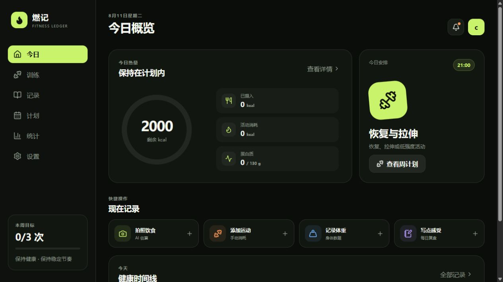
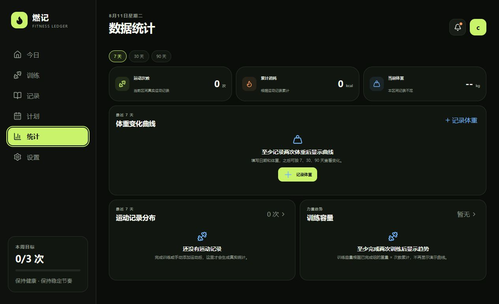

<div align="center">

# 燃记 · FITNESS LEDGER

**把训练、饮食、体重和专注记录在同一个本地健身账本里。**


</div>

燃记是一款面向个人健身场景的本地优先应用。它将训练记录、三分化训练计划、组间计时、番茄钟、健康日记、热量账本、体重曲线和 AI 拍照识别整合到同一个界面，并可通过 Capacitor 打包为 Android APK。

> 当前项目处于可运行原型阶段，适合个人使用、功能验证和二次开发，尚未接入生产级云端账号与数据同步服务。

## 界面预览

### 今日概览



### 数据统计



## 核心功能

- **本地账号**：注册、登录、退出和按账号隔离数据；新账号不写入演示流水。
- **训练管理**：训练动作、重量、次数、组数、组间休息、训练容量和完成记录。
- **训练计划**：内置周一练胸、周三练背、周五练臀腿的三分化模板，支持导入和自定义计划。
- **动作演示**：内置 15 个离线动作 GIF，无网络时也能查看动作参考。
- **健康账本**：记录饮食、运动消耗、体重、日记和每日健康时间线。
- **AI 食物识别**：拍照或选择图片后，调用 OpenAI 或兼容视觉接口估算食物、热量和营养数据。
- **统计分析**：支持 7 天、30 天和 90 天区间，展示运动次数、累计消耗、体重趋势与训练容量。
- **专注计时**：提供番茄钟和训练休息倒计时。
- **多端运行**：支持浏览器、Electron 桌面原型和 Capacitor Android。

## 技术栈

| 模块 | 技术 |
| --- | --- |
| 前端 | React 19、Vite 8、Lucide React |
| 本地数据 | LocalStorage、Web Crypto |
| Android | Capacitor 8、Android Gradle Plugin |
| 原生能力 | Camera、Browser、App 插件 |
| 桌面端 | Electron |
| 测试 | Node.js Test Runner |
| AI 接口 | OpenAI Chat Completions 兼容视觉接口 |

## 快速开始

### 环境要求

- Node.js 20 或更高版本
- npm 10 或更高版本
- Android 构建需要 JDK 21、Android SDK 36 和 Build Tools 36

### 安装与启动

```bash
git clone git@github.com:linlinyaoo/FITNESS-LEDGER.git
cd FITNESS-LEDGER
npm install
npm run dev
```

打开 Vite 输出的本地地址，通常为 `http://localhost:5173/`。

### 测试与生产构建

```bash
npm test
npm run build
```

## Android 使用

### 同步 Web 资源

```bash
npm run android:sync
```

### 在 Android Studio 中打开

```bash
npm run android:open
```

### 构建本地 APK

Windows PowerShell 环境下：

```powershell
npm run android:apk
```

构建脚本会检查 JDK 21 和 Android SDK 36，随后生成经过资源压缩的本地 APK。安装包输出到 `release-apk/`，该目录属于构建产物，不提交到 Git。

## AI 食物识别配置

进入应用的 **设置 → AI 食物识别模型**，填写：

- 服务类型：OpenAI 或 OpenAI 兼容接口
- API Base URL，例如 `https://api.openai.com/v1`
- 支持图片输入的模型名称
- API Key

应用会将当前照片转换为图片数据并请求视觉模型，解析结构化的食物名称、份量、热量、蛋白质、碳水和脂肪结果。低置信度结果会提示用户人工核对。

> API Key 目前仅保存在当前设备的本地存储中。公开部署或多人使用时，请改用服务端代理，不要把密钥写入源码、README、提交记录或前端环境变量。

也可以通过环境变量执行命令行模型连通性测试：

```powershell
$env:MODEL_API_KEY="your-api-key"
$env:MODEL_BASE_URL="https://api.openai.com/v1"
$env:MODEL_NAME="gpt-4.1-mini"
npm run test:model -- "C:\path\to\food.jpg"
```

## 数据与隐私

当前版本采用本地优先设计：

- 账号、训练、体重、饮食、日记和模型配置默认保存在当前浏览器或 Android WebView。
- 不提供云同步，也不会自动上传全部本地数据。
- 只有使用 AI 食物识别时，用户选择的照片才会发送到所配置的模型服务。
- 本地账号系统用于原型数据隔离，不等同于生产级身份认证。
- 清除浏览器数据、卸载应用或重置账号可能导致记录丢失。

## 项目结构

```text
FITNESS-LEDGER/
├─ android/                  Capacitor Android 工程
├─ docs/images/              GitHub 项目展示截图
├─ electron/                 Electron 启动与预加载脚本
├─ public/exercise-gifs/     离线动作 GIF 和媒体许可说明
├─ scripts/                  模型测试与 APK 构建脚本
├─ src/
│  ├─ App.jsx                全局状态与业务入口
│  ├─ AuthPage.jsx           本地注册与登录
│  ├─ WorkoutPage.jsx        训练列表与训练过程
│  ├─ RecordsPlanStats.jsx   记录、计划与统计
│  ├─ SettingsPage.jsx       设置、数据和模型配置
│  ├─ Modals.jsx             表单、计时器和计划弹窗
│  ├─ foodVision.js          图片识别请求与结果校验
│  ├─ nativeCamera.js        Web/Android 拍照适配
│  └─ model.js               默认计划与本地持久化
├─ test/                     视觉模型解析与请求测试
├─ capacitor.config.json
├─ package.json
└─ README.md
```

## 常用脚本

| 命令 | 作用 |
| --- | --- |
| `npm run dev` | 启动 Vite 开发服务器 |
| `npm test` | 运行自动化测试 |
| `npm run build` | 构建 Web 生产资源 |
| `npm run test:model -- <图片>` | 使用真实图片测试视觉模型 |
| `npm run android:sync` | 构建并同步到 Android 工程 |
| `npm run android:open` | 在 Android Studio 打开工程 |
| `npm run android:run` | 同步并运行 Android 应用 |
| `npm run android:apk` | 在 Windows 上构建精简 APK |
| `npm run desktop:run` | 运行 Electron 桌面原型 |
| `npm run desktop:dist` | 构建 Windows 便携版 |

## 当前限制

- 数据只保存在本地，暂不支持跨设备同步和自动备份。
- AI 识别结果受图片质量、菜品遮挡、模型能力和份量判断影响，不能替代营养师意见。
- 浏览器直接访问第三方模型接口时可能受到 CORS 限制。
- 本地密码摘要与会话机制仅用于原型，不能替代服务端认证。
- 训练动作 GIF 仅用于动作参考，不能替代专业教练指导。

## 后续路线图

### 近期

- 增加训练计划 JSON/Excel 导入模板和字段校验。
- 完善训练历史详情、个人纪录和动作维度趋势。
- 增加本地数据备份、恢复和版本迁移。
- 为关键页面补充组件测试和端到端测试。
- 优化 Android 拍照压缩、识别失败重试和离线体验。

### 中期

- 引入可选的云端账号、端到端加密同步和多设备恢复。
- 增加饮食收藏、常用餐、条码扫描和营养目标管理。
- 增加训练模板市场、周期计划和渐进超负荷建议。
- 增加系统通知、训练提醒、番茄钟后台提醒和桌面组件。

### 长期

- 提供教练与学员协作模式。
- 基于长期训练数据生成可解释的训练调整建议。
- 支持穿戴设备、健康平台和更多运动数据来源。

## 动作媒体说明

`public/exercise-gifs/` 中的动作媒体来自 exercises-dataset-zh 项目，并保留其许可与署名文件。媒体版权归 **Gym visual** 所有，仓库中的许可文件不代表本项目向使用者授予额外媒体权利。复制、分发或商用前，请阅读：

- `public/exercise-gifs/MEDIA-NOTICE.md`
- `public/exercise-gifs/DATASET-LICENSE.txt`

## 开源许可证

除单独标明的第三方动作媒体外，项目业务代码采用仓库根目录 `LICENSE` 中的 **Apache License 2.0**。动作 GIF 不受项目 Apache-2.0 许可证覆盖，其使用仍以媒体目录内的许可与署名说明为准。

## 参与开发

欢迎通过 Issue 提交问题、交互建议和兼容性反馈。提交代码前请确保：

```bash
npm test
npm run build
```

提交内容请避免包含 API Key、真实账号数据、个人照片、APK、SDK、日志和本地路径配置。
